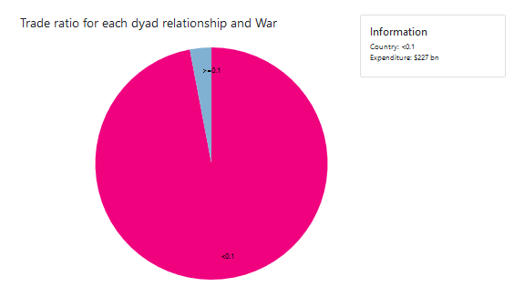
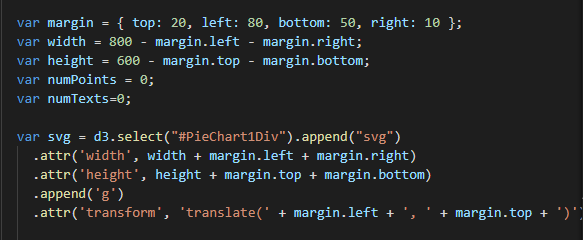
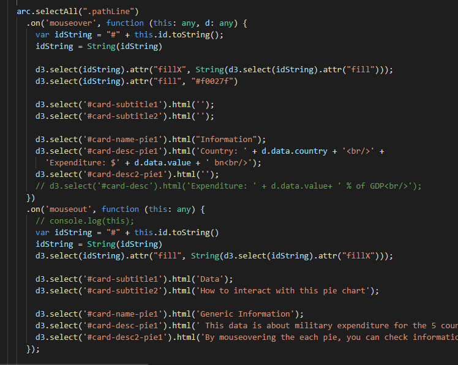
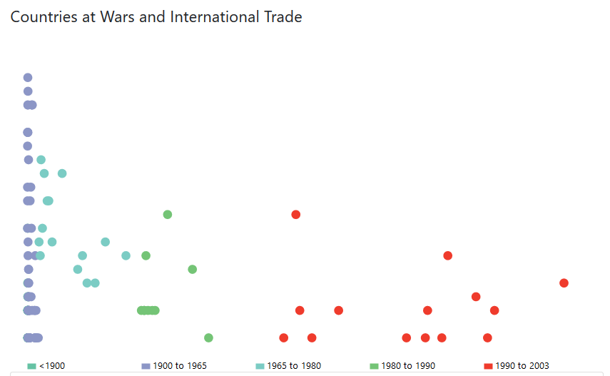
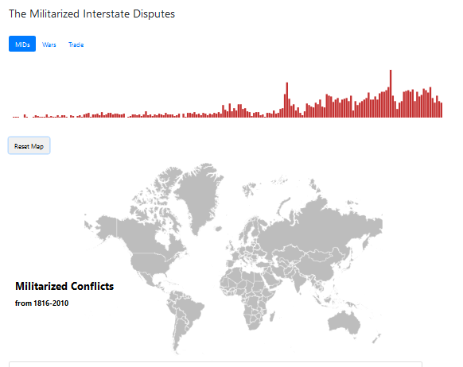
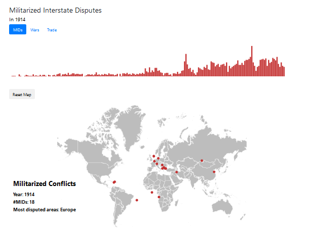
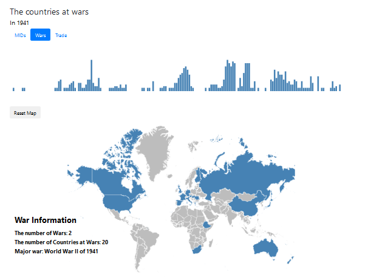

## 1. Implementation of the main page.

    By using the bootstrap example code, we made the main webpage.

## Bubble chart
    By mouseovering each circle, we can check each information of each period with tooltips. 
### 

## 0. Format your files and Load the JSON file.
### Bubble chart(The file named, BothWarAndTradeInter10ForBubble.json)
    To make json file for this bubble chart, we need the war data set and trade. There are 3 parts, which are BeforeWWone, BetweenWWoneWWtwo, and PostWWtwo. And in each part, there are records about wars, trade, and the name of major war. we upload the python file for processing data(554DataPreprocessing.py).
####  

## 1. Implementation of the Bubble chart.
### 1-1 Explanation about bubble-war-trade.html
    For the bubble chart, we need to implement html code. The code is located in this bubble-cir-pack.component.html.
    We can see the structure of each part such as where card and tooltips are located.
    Based on this html code, we implement the bubble chart.
### 1-2 Explanation about bubble-war-trade.ts
#### About bubble chart
    We implement js code in this file. For implementing this code, the most important part is to format the json file well. We explain the code in ts file. We select the div with BubbleChar1Div.
####    
    The root variable is made using d.value, which means expenditure. And it is sorted using the values.
####    
    The circles have the class named cir1. we can check how the radius and color are set. 
####   

#### About tooltip in the bubble chart.
    When user mouseovers each pie, which is class cir1 in my code, the function on('mouseover') shows the tooltip. This photo shows how it works. The principle is not complicated.
    The x,y position means where tooltip is located. So, by using the tooltip-bub1 (in the html code), if mouseover occurs, it shows the tooltip and if user mouseouts, the tooltip is hidden.
####   


## Pie chart
    On the right side of the chart, there are generic informtion about data and how to use the pie chart. If we mouseover on each pie, we can check the color of the selected pie can be changed. And the card also changes, based on user's selection on the pies.
### 
### 


## 0. Format your files and Load the JSON file.
### Pie chart(The file named, tradeImportanceAndWarsPoint1.json)
    The structure of this json file is simple. The value represents the number of war between two countries. The country <0.1 and value 227  in file represent the 227 number of war whose trade dependency is smaller than 0.1. To make this json, we need war data set and trade dataset (dyad trade data set and nation trade data set). we upload the python file for processing data(554DataPreprocessing.py). 
   

## 1. Implementation the Pie chart.
### 1 Explanation about piechart.component.html
    For pie chart, we need to implement html code. The code is located in piechart.component.html.
    we can see the structure of each part such as where card and tooltips are located.
    Based on this html code, we implement the pie chart.
## 2 Explanation about piechart.component.ts
### About pie chart
    we implement js code in this file.   
    margin convention is used. svg is appended with id PieChart1Div.
<!-- ####    -->

```javascript
    var margin = { top: 20, left: 80, bottom: 50, right: 10 };
    var width = 800 - margin.left - margin.right;
    var height = 600 - margin.top - margin.bottom;
    var numPoints = 0;
    var numTexts = 0;

    var svg = d3.select("#PieChart1Div").append("svg")
      .attr('width', width + margin.left + margin.right)
      .attr('height', height + margin.top + margin.bottom)
      .append('g')
      .attr('transform', 'translate(' + margin.left + ', ' + margin.top + ')');
```

    By using pie generator, the pies are made.
<!-- ####   -->
```javascript
d3.json("tradeImportanceAndWarsPoint1.json").then(function (data: any) {

      data.value = +data.value;
      var arc = g.selectAll(".arc")
        .data(pie(data)) //use pie generator to create the data needed for the each slice of the pie
        .enter().append("g")
        .attr("class", "arc");
      arc.append("path") //for each slide use arc path generator to draw the pie
        .attr("d", path)
        .attr("class", "pathLine")
        .attr("id", function (d: any) {
          countryName.push(d.data.country); 
          countryName.sort()
          color.domain(countryName.sort());
          numPoints = numPoints + 1;
          return "pathLine1" + (numPoints + 1).toString();
        })
        .attr("fill", function (d: any) { return color(d.data.value); }); //get data from node (select and $0.__data__ in console)
      arc.append("text") //for each slide use label path generator to place the text
        .attr("transform", function (d: any) {
          // console.log(label.centroid(d));
          return "translate(" + label.centroid(d) + ")";
        })
        .attr("class", function () {
          return "textonpie"
        })
        .attr("id", function () {
          numTexts = numTexts + 1;
          return "textonpie" + (numTexts + 1).toString();
        })
        .attr("dy", "0.35em")
        .text(function (d: any) { return d.data.country; });

```

<!-- ####      -->
    This photo is about mouseover and mouseout.
    The pies have each id and common class named pathLine. By using the id, we change the fill. And we deal with card. And the mouseout is same. So if user mousevovers, the color of each pie and card information are changed.


## Scatter Plot
    By mouseovering each circle, and then we can check information of each year with tooltips. 
### 

## 0. Format your files and Load the csvfile.
### Bubble chart(The file named, WarAndTrade_From1870.csv)
    To make csv file , we need the war data set and trade. After processing them, we made the file, named WarAndTrade_From1870.csv. The file has information about year, the number of countries at wars, sum of trade amount. we upload the python file for processing data(554DataPreprocessing.py).
####  

## 1. Implementation the scatter plot.
### 1-1 Explanation about scatter.component.html
    For the scatter plot, we need to implement html code. The code is located in this scatter.component.html.
    we can see the structure of each part such as where card and tooltips are located.
    Based on this html code, we implement the scatter plot.
## 1-2 Explanation about scatter.component.html.ts
### About scatter plot
    we implement js code in this file. For implementing this code, we made csv file. We explain the code in ts file. We select the div with scatterChart1Div.
<!-- ####     -->


```javascript
var svg = d3.select("#scatterChart1Div").append("svg")
        .attr('width', width + margin.left + margin.right)
        .attr('height', height + margin.top + margin.bottom)
        .append('g')
        .attr('transform', 'translate(' + margin.left + ', ' + margin.top + ')');
```
    
<!-- ####     -->
    Each circle is made by using data join.

```javascript
          svg.selectAll("circle")
        .data(dataset)
        .enter()

        .append("circle")
        .attr('id', function (data) {
          return data['year']
        })

        .attr('cx', function (data) {


          return x(+data["SumTrade"])
          
        })
        .attr('cy', function (data) {


          return (y(+data["countCouWars"]));

        })
        .attr('r', function () {
          return 8;
        })
```

    Each circle is filled based on the year. 
```javascript
        .style("fill", function (data) {

        var color;
        if (+data['year']<1900)
        {
            color = "#66c2a4";
        }

        if (+data['year']>=1900 && +data['year']<1965)
        {
            color = "#8c96c6";
        }
```

    Tooltip works based on mouse point coordinate.
```javascript
    .on("mouseover",function(this:any,d:any){

          var tooltipSpan = document.getElementById('tooltip-scatter1');

          window.onmousemove = function (e) {
            var x = e.clientX,
              y = e.clientY;
            // (x)
            // console.log(y)
            tooltipSpan.style.top = (y - 115) + 'px';
            // console.log(y)
            tooltipSpan.style.left = (x + 2) + 'px';

            if (y<150)
            {
              tooltipSpan.style.top = (y + 20) + 'px';
            }
            if (x>1000)
            {
              tooltipSpan.style.left = (x -125) + 'px';
            }
          };
```

<!-- ####    -->

```javascript
          d3.select('#tooltip-scatter1')

              .select('#planet-info-scatter1')
              .html('<h4>' + 'Year: '+d.year+'<br>'+" Countries at Wars: "+d. countCouWars +  '<br>'+'Total trade amount: '+d.SumTrade+'<br>');

          d3.select('#tooltip-scatter1').classed('hidden', false);
   
```


    When user mouseover circle, or rectangle, or year, its edge is black and thick.
```javascript
 d3.select(this)
        // .style('fill','yellow')
          .style("stroke","black")
          .style("stroke-width","2")
```


   When user mouseout circle, or rectangle, or year, its edge and tooltip disappear.
```javascript

  d3.select('#tooltip-scatter1').classed('hidden', true);
  d3.select('#planet-info-scatter1').classed('hidden', true);

  d3.select(this)
   .style("stroke-width","0")
```


## Bar chart
    By mouseovering each circle, we can check information of each period with tooltips. 
### 

## 0. Format your files and Load the JSON file.
### Bubble chart(The file named, BothWarAndTradeInter10ForBubble.json)
    To make json file for this bubble chart, we need the war data set and trade. There are 3 parts, which are BeforeWWone, BetweenWWoneWWtwo, and PostWWtwo. And in each part, there are records about wars, trade, and the name of major war. we upload the python file for processing data(554DataPreprocessing.py).
####  

## 1. Implementation the Bubble chart.

### 1-1 Explanation about bubble-war-trade.html
    For the bubble chart, we implement html code. The code is located in this bubble-cir-pack.component.html.
    We can see the structure of each parts such as where card and tooltips are located.
    Based on this html code, we implement the bubble chart.
### 1-2 Explanation about bubble-war-trade.ts
#### About bubble chart
    we implement js code in this file. For implementing this code, the most important part is to format the json file well. Let's me explain my code in ts file. we select the div with BubbleChar1Div.
####    
    The root variable is made using d.value, which means expenditure. And it is sorted using the values.
####    
    The circles have the class named cir1. we can check how the radius and color are set. 
####   

#### About tooltip in the bubble chart.
    When user mouseovers the each pie, which is class cir1 in my code, the function on('mouseover') shows the tooltip. This photo shows how it works. The principle is not complicated.
    The x,y position means where tooltip is located. So, by using the tooltip-bub1 (in the html code), if mouseover occurs, it shows the tooltip and if user mouseouts, the tooltip is hidden.
####   


#### 
#### 
#### 
#### 


## 0. Format your files and Load the JSON file.
#### Data Processing
    We need MIDs dataset, wars dataset, and trade dataset. The processed MIDs data shows how many MIDs have been occured in each year. The continent represents which area is the most disputed area. 1-7 represent Africa, Antarctica, Asia, Australia, Europe, North America,  and South America. The processed war data shows how many countries have been at wars in each year. The processsed trade data represents the sum of trade amount, how many trade relationships there were, how many contries took part in international trade, which countries they are. we upload the python file for processing data(554DataPreprocessing.py).


    MIDs data
#### 
    War data
####  
    Trade data
#### 


## 1. Implementation the dot on the map.
#### Load files
    To load these two files, we use forEach function.

```javascript

    var files = [

      "map_COW.geojson",//values[0] map 
      "MIDLOCA_2.0.csv",//values[1] MIDs
      "directed_dyadic_war_lati_long_stateName_allYear.csv",//values[2]
      "COW country codes_lati_long.csv",//values[3]
      "Dyadic_COW_4.0_flow2_1870.json",//values[4]
      "MIDLOCA_2.0_groupbycountbyyearAllYearConti.csv",//values[5]
      "directed_dyadic_war_lati_long_stateNamecountbyyearAllVer3.csv",//values[6]
      "Dyadic_COW_4.0_Processed_WithCcode.csv", //trade dataset //values[7],
      "Inter-StateWarsList-Ver2.csv",//values[8]
      "National_COW_4.0.csv"

    ];


    var promises = [];

    files.forEach(function (url) {
      var partsOfurl = url.split('.');

      if (partsOfurl[partsOfurl.length - 1] == "geojson" || partsOfurl[partsOfurl.length - 1] == "json") { promises.push(d3.json(url)) }
      if (partsOfurl[partsOfurl.length - 1] == "csv") { promises.push(d3.csv(url)) }

    });

```

#### Draw world map
    we use geoMercator function. By using the geojson file, we do projection. And then we draw the path using data join.
    
```javascript
    var projection = d3.geoMercator().fitSize([width, height], worldmapPath);

    var path = d3.geoPath().projection(projection);

    //MAP part
    svg.selectAll(".states")
        .data(worldmapPath.features)

        .enter()
        .append("path")
        // .attr("fill", "#bdbdbd")
        .attr("fill", "#bdbdbd")
        .attr("id", function (d: any) {
        // console.log(d);
        //country name
        allCCodeOnmap.push(d.properties.A3)
        return d.properties.A3
        })
        .attr("class", "country")
        .attr("stroke", "white")
        .attr("stroke-width", "0.5px")
        .attr("d", path)

        .on('mouseover', function (this: any, d: any) {
```

    This is about tooltip and responsive map. Tooltip works based on the mouse coordinate. And when user mouseover on the map, the gray color changes to steelblue color.

```javascript
        .on('mouseover', function (this: any, d: any) {
            // var centr = path.centroid(d)


        var tooltipSpan = document.getElementById('tooltip-mid');

        window.onmousemove = function (e) {
            var x = e.clientX,
            y = e.clientY;
            tooltipSpan.style.top = (y - 20) + 'px';
            tooltipSpan.style.left = (x - 55) + 'px';
        };


        d3.select('#tooltip-mid')
            
            .select('#country-info-mid')
            .html('<h4>' + d.properties.A3 + '</h4>');

        d3.select('#tooltip-mid').classed('hidden', false);

        var idString = "#" + this.id.toString();
        idString = String(idString)

        console.log(idString)

        d3.select(idString).attr("fillX", String(d3.select(idString).attr("fill")));
        d3.select(idString).attr("fill", "steelblue");

        })
```

    When user mouseout, every responsive parts return to the initial state.

```javascript
    .on('mouseout', function (this: any) {

    d3.select('#tooltip-mid').classed('hidden', true);
    d3.select('#tooltip-midInfor').classed('hidden', true);

    var idString = "#" + this.id.toString()
    idString = String(idString)
    d3.select(idString).attr("fill", String(d3.select(idString).attr("fillX")));
    })
```


#### Draw Bar chart.
By using data join, we make the bars
<!-- ####   -->

```javascript

svgmidsBar.selectAll(".bar")
          .data(dataset, function (d: any) { return d.year; })
          .enter()
          .append("rect")
          .attr("id", function (d: any) {
            return "midscountbar" + d.year.toString();
          })
          .attr("class", "midscountbar")
          .attr("x", function (d: any) { return x(d.year); })
          .attr("y", function (d: any) { return y(d.countmids); })
          .attr("width", x.bandwidth())
          .attr("height", function (d: any) { return heightMIDBar - y(d.countmids); })
          .attr("fill", "rgb(196, 50, 50)")

```

When user hovers the mouse on the bars, the MIDs information change. We make code part which shows these changes in the map below. We explain and show the corresponding information in the map. But others have same principle. Therefore we omitted to explain them.

```javascript
d3.select("#WarMajorOnMap")
    // .attr("absolute","absolute")
    // .attr("top", "70px")
    // .attr("right", "15px")
    // .attr("y", 400)
    .transition()
    .duration(1000)
    .style("color", "black")
    .on("start", function transitionHeaderIn() {

    var t = d3.active(this)
        .style("opacity", 0)
        .remove();
    // console.log(t)

    d3.select("#WarMajorOnMap")
        .style("opacity", 0)
        .text("Militarized Conflicts")
        .transition(t)
        .style("opacity", 1)
        .style("color", "black")
        .transition()
        .delay(1000);
    });

svg.append("text")
    .attr("id", "WarTitleOnMap")
    .attr("x", 0)
    .attr("y", 360)
    .attr("font-size", '17px')
    .attr("font-weight", "bold")
```


#### Draw Corresponding MIDs Points.
    We combine bar charts with map. When user mouseover on the MIDs bars, user can see the outbreak location of the MIDs. The dotsdrawMIDsDotOnMap function is the part. The MID dots on the map is made, using data join. This function is located in on click of the bar charts. 
```javascript

 var mids = svg.selectAll(".mid")
          .data(data);
        var delay = function (d, we) {
          return we * 50;
        }
        // UPDATAE.
        mids.transition()
          .duration(750)
          .delay(delay)
        mids.attr("cx", function (d: any) {
          // console.log(+d.midloc2_xlongitude)
          var marker = projection([+d["midloc2_xlongitude"], +d["midloc2_ylatitude"]])
          return marker[0]
        })
        .attr("cy", function (d: any) {
          var marker = projection([+d["midloc2_xlongitude"], +d["midloc2_ylatitude"]])
          return marker[1]
        })
        .attr("id", function (d: any) {
          var tempId = "conflict" + String(d.dispnum)
          return String(tempId);
        })
        .attr("r", 5)
        .attr("fill", "rgb(196, 50, 50)")
        // .style("opacity", 0)
        .attr("class", "mid")


        // ENTER.
        mids.enter()
          .append("circle")
          .attr("cx", function (d: any) {
            var marker = projection([+d["midloc2_xlongitude"], +d["midloc2_ylatitude"]])
            return marker[0]
          })
          .attr("cy", function (d: any) {
            var marker = projection([+d["midloc2_xlongitude"], +d["midloc2_ylatitude"]])
            return marker[1]
          })
          .attr("id", function (d: any) {
            var tempId = "conflict" + String(d.dispnum)
            return String(tempId);
          })
          .attr("r", 5)
          .attr("fill", "rgb(196, 50, 50)")
          // .style("opacity", 0)
          // .attr("fill", "white")
          .attr("class", "mid")
          .on('mouseover', function (this: any, d: any) {
            var idString = "#" + this.id.toString();
            idString = String(idString)
            d3.select(idString).attr("fillX", String(d3.select(idString).attr("fill")));
            d3.select(idString).attr("fill", "steelblue")

            d3.select(idString).attr("rX", String(d3.select(idString).attr("r")));
            d3.select(idString).attr("r", "5")
          
            var idString = "#" + this.id.toString()
          
            dothandleMouseOver(idString, d)

          })

```
    When user mouseovers the MID point, it provide year and location information.
```javascript

    d3.select(idString).attr("fillX", String(d3.select(idString).attr("fill")));
    d3.select(idString).attr("fill", "steelblue");

    var temp = values[1].filter(x => x.year == String(yearString))

    // repulse()
    drawMIDsDotOnMap(temp)
    // pulse()

    // repulse()

    })

    .on('mouseout', function (this: any) {
    // console.log(this);
    var idString = "#" + this.id.toString()
    idString = String(idString)
    d3.select(idString).attr("fill", String(d3.select(idString).attr("fillX")));
    d3.select(idString).attr("r", String(d3.select(idString).attr("rX")));

    var idString = "#" + this.id.toString()
    // console.log(idString)
    dothandleMouseOut(idString)
    });


``` 

    Until here, we explain what parts of code are related to each part of visualization.
    Using similar methods, we plot the bars and maps for the wars and trade datasets.


<!-- #### Draw Corresponding countries Color On Wars.
    By using the json file about military expenditure, we draw the centroid. But when we draw it, we must need to project the longitude and latitude. 
####  


#### Draw Corresponding countries Color On Trade
    By using the json file about military expenditure, we draw the centroid. But when we draw it, we must need to project the longitude and latitude. 
####   -->


